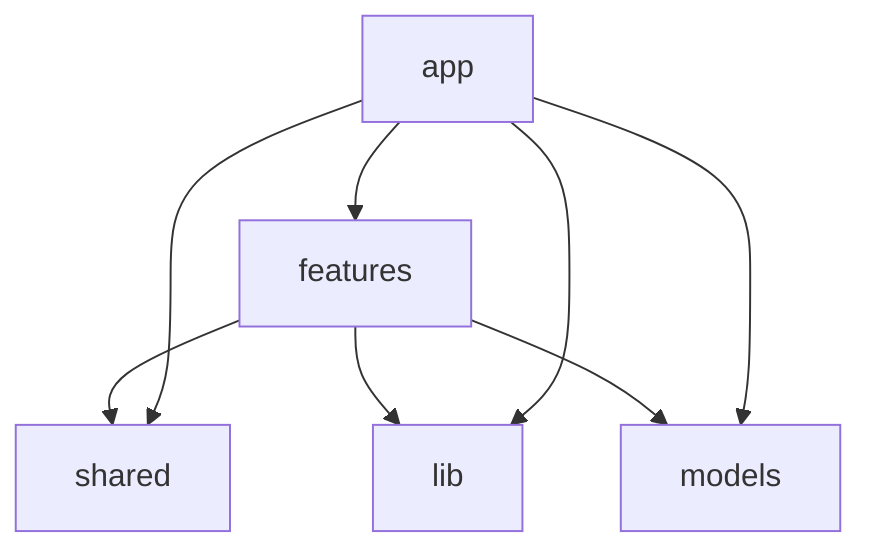

# Folder Structure Guide

This document outlines the structure and responsibilities of the main folders in this project. It helps clarify boundaries between features, shared modules, and infrastructure code, especially for large-scale, long-term maintenance and AI-assisted development.

---

## `/app`

Application-level glue code that composes features and shared modules into actual pages or interactive views.

- `components/`: App-specific UI parts that are not meant to be reused elsewhere.
- `models/`: Application-specific data models, typically plain types or interfaces used across components and features.
- `repository/`: Data access layer, including remote API interaction or persistence abstraction.
- `tools/`: **Internal logic modules used for AI workflows or canvas operations.**  
  Each tool typically represents an atomic action such as inserting a node, creating a draft, or running an embedded agent.

---

## `/features`

Each folder represents a self-contained **application feature or use case**, encapsulating UI, state, and logic together.

### Responsibilities:

- Own all logic, types, and UI necessary for a single function
- Avoid direct dependencies on other features (no coupling)
- May depend on `shared`, `lib`, `models`

### Examples:

- `llm-chat-ui/`: LLM chat window feature
- `markdown-editor/`: Markdown editing feature
- `svg-canvas/`: Diagram and drawing canvas feature

---

## `/shared`

Contains **reusable utilities, components, and logic** that are used by multiple features or by the app root.

### Responsibilities:

- Cross-feature UI components (e.g., `Button`, `Modal`)
- Reusable hooks, utility functions, types
- Not tied to any one use case or business domain
- Should not depend on any feature

### Examples:

- `shared/llm-client`: API client for OpenAI (used by multiple features)
- `shared/markdown`: Markdown parsers, renderers, utilities

---

## `/lib`

Holds **low-level integrations with external services or infrastructure**, often wrapping SDKs or setting up core behaviors.

### Responsibilities:

- Initialization and configuration of axios, Firebase, OpenAI, etc.
- Auth and error handling middlewares
- Typically imported by shared or features modules

---

## `/utils`

Lightweight utility functions that have no state or UI concern. Can also be merged into `shared/utils/` if preferred.

---

## Module Dependency Graph

