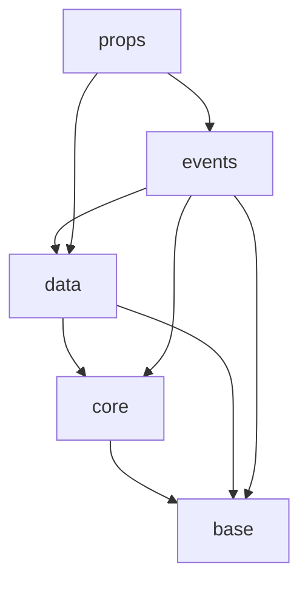

# svg-canvas Dependency Rules

## `types` Module

The `types` module must not import any code from outside the module itself.  
It serves as the root of the dependency tree.

Within the `types` module, files may import other files from the same module,  
but such imports must follow the dependency graph defined below.

- `base`: Fundamental types with no dependencies on other types.
- `core`: Core types that optionally depend only on `base` types.
- `data`: Diagram data types that optionally depend on `base` and `core` types.
- `events`: Event-related types that may depend on all of the above.
- `props`: Diagram props types that optionally depend on `data` and `events` types.