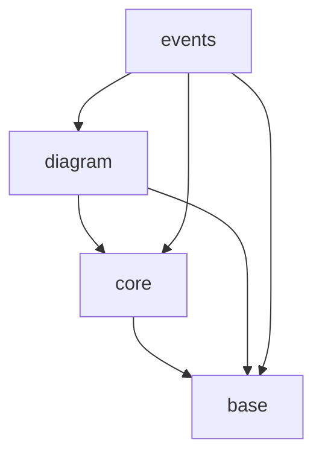

# svg-canvas Dependency Rules

## types
The `types` module must not import any other module. It is the base of the dependency tree.
It is permitted to import only from other files within the `types` module, 
and such imports must comply with the depencency graph specified below.

- `base`: Most fundamental types with no dependencies on other types
- `core`: Core types that may depend only on `base` types
- `diagram`: Diagram-specific types that may depend on `base` and `core` types
- `events`: Event-related types that may depend on all other type categories