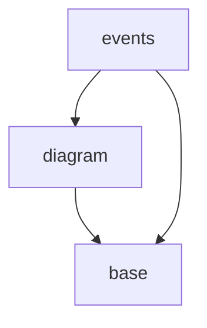

# svg-canvas Dependency Rules

## types
The `types` module must not import any other module. It is the base of the dependency tree.
It is permitted to import only from other files within the `types` module, 
and such imports must comply with the depencency graph specified below.

