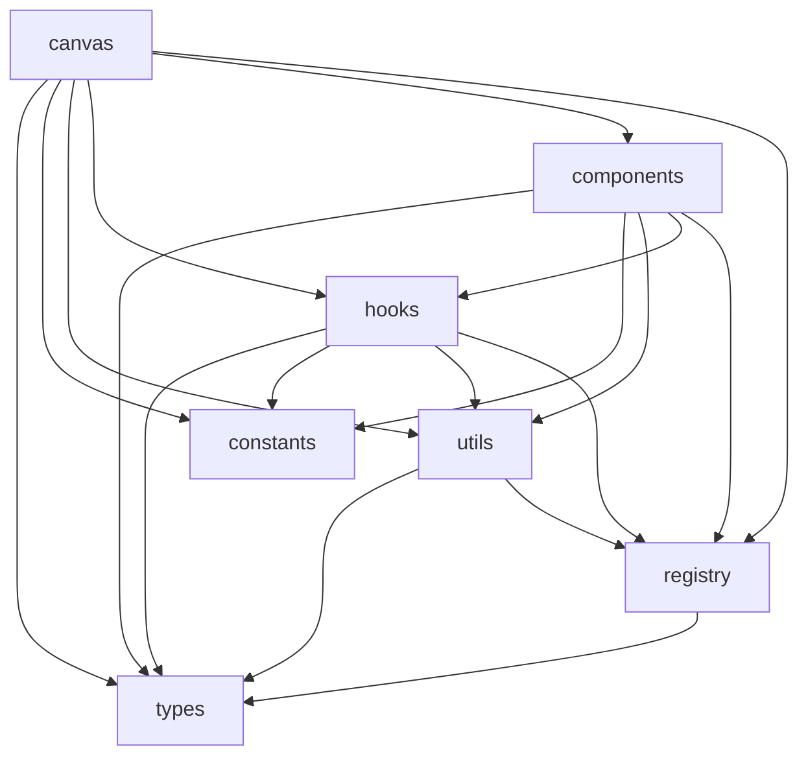
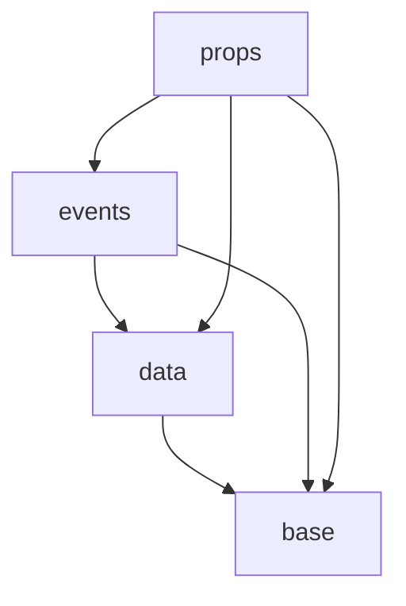
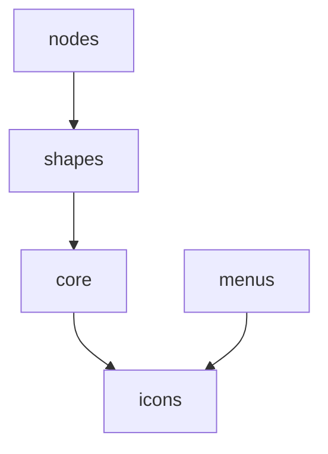

# svg-canvas Dependency Rules

## General Rules

```mermaid
graph TD
    registry --> types
    utils --> types
    utils --> registry
    hooks --> types
    hooks --> constants
    hooks --> utils
    hooks --> registry
    components --> types
    components --> constants
    components --> utils
    components --> hooks
    components --> registry
    canvas --> types
    canvas --> constants
    canvas --> utils
    canvas --> hooks
    canvas --> components
    canvas --> registry
```

## `types` Module

```mermaid
graph TD
    data --> base
    events --> base
    events --> data
    props --> base
    props --> data
    props --> events
```

## `components` Module

```mermaid
graph TD
    core --> icons
    shapes --> core
    nodes --> shapes
    menus --> icons
```